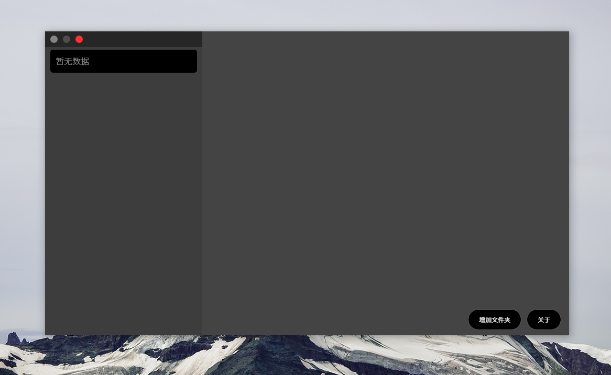
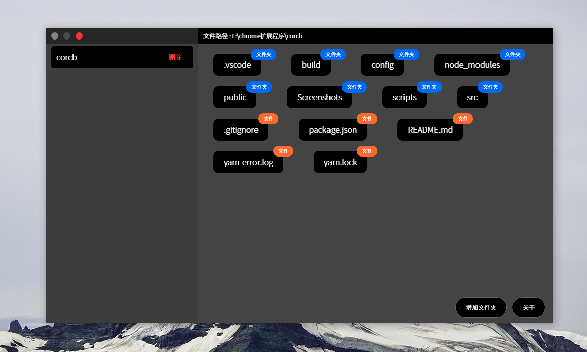
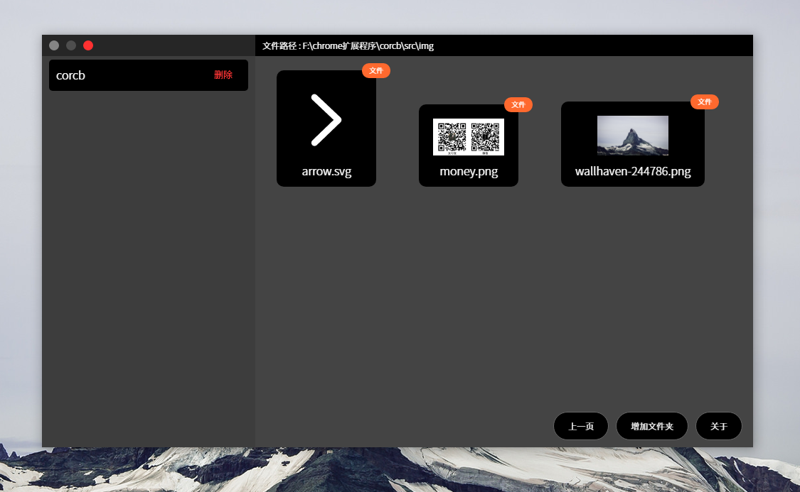

# corsvgbrowser

写 corsvgbrowser 的动机是为了解决在开发的时候想要查看svg文件，但，window 上并没有找到可以预览svg文件的软件，之前都是用把
文件拖入chrome中进行查看，但是文件数量多了之后，想要找到是某个文件对我来说是一件困难的事情，所以corsvgbrowser就诞生了，corsvgbrowser主要是用于
查看svg文件，并不是代替资源文件管理器



#### Build Setup

``` bash
# install dependencies
yarn

# serve with hot reload at localhost:9080
yarn dev

# build electron application for production
yarn build


```

---

This project was generated with [electron-vue](https://github.com/SimulatedGREG/electron-vue) using [vue-cli](https://github.com/vuejs/vue-cli). Documentation about the original structure can be found [here](https://simulatedgreg.gitbooks.io/electron-vue/content/index.html).
